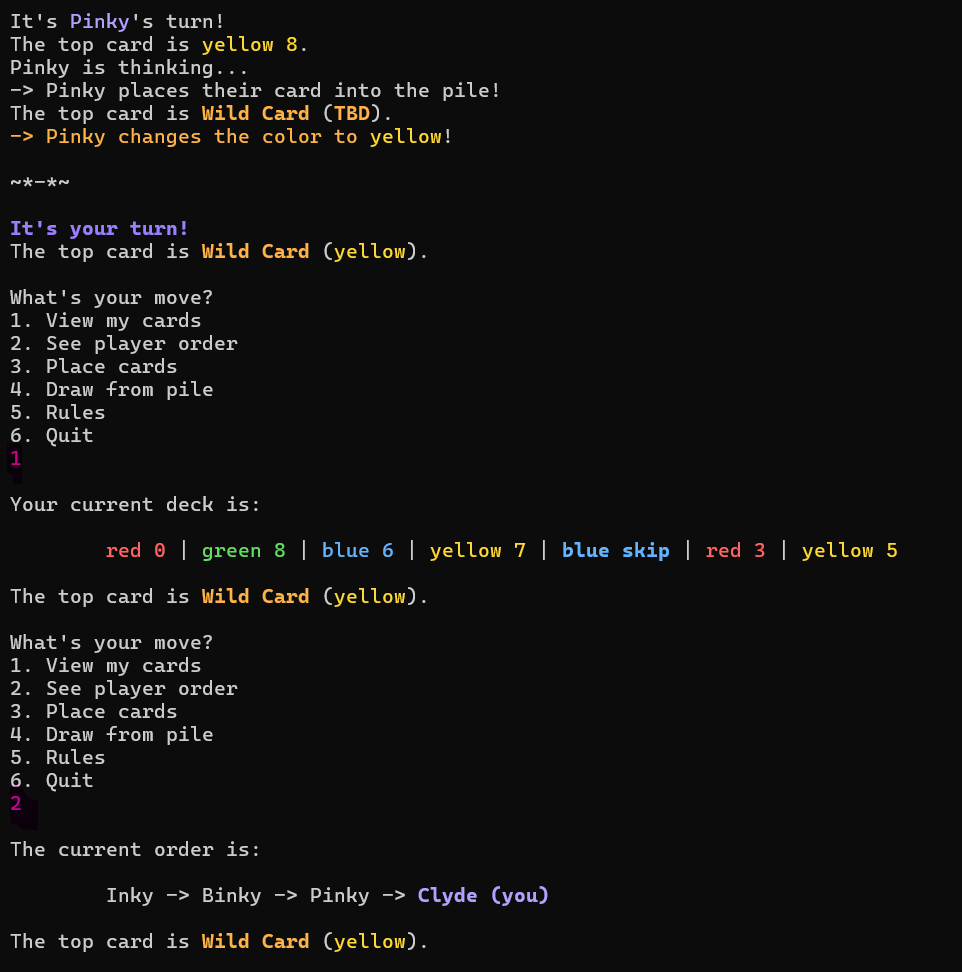
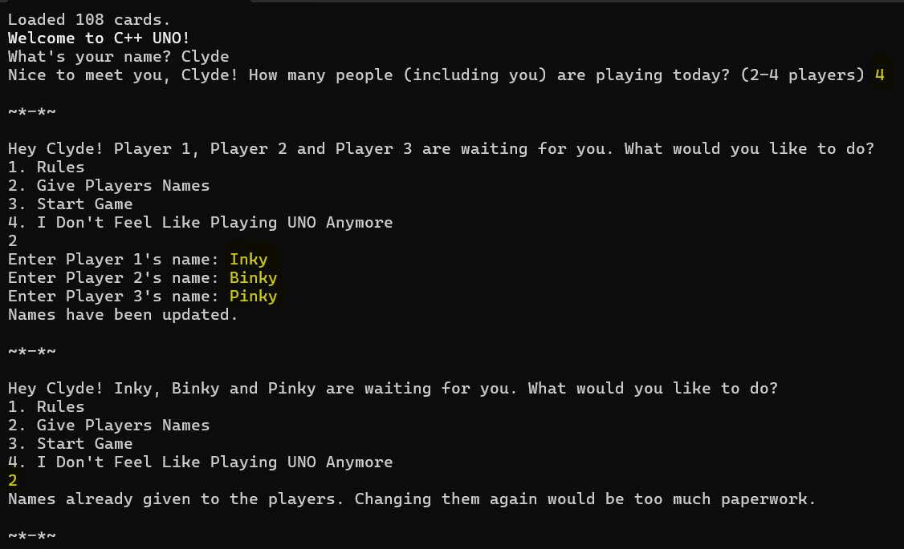
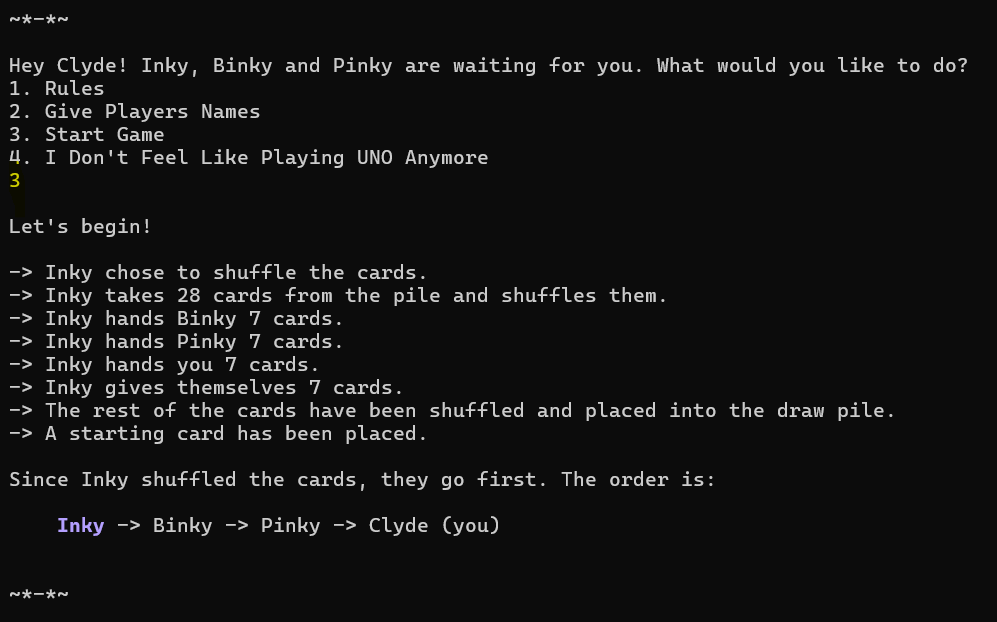
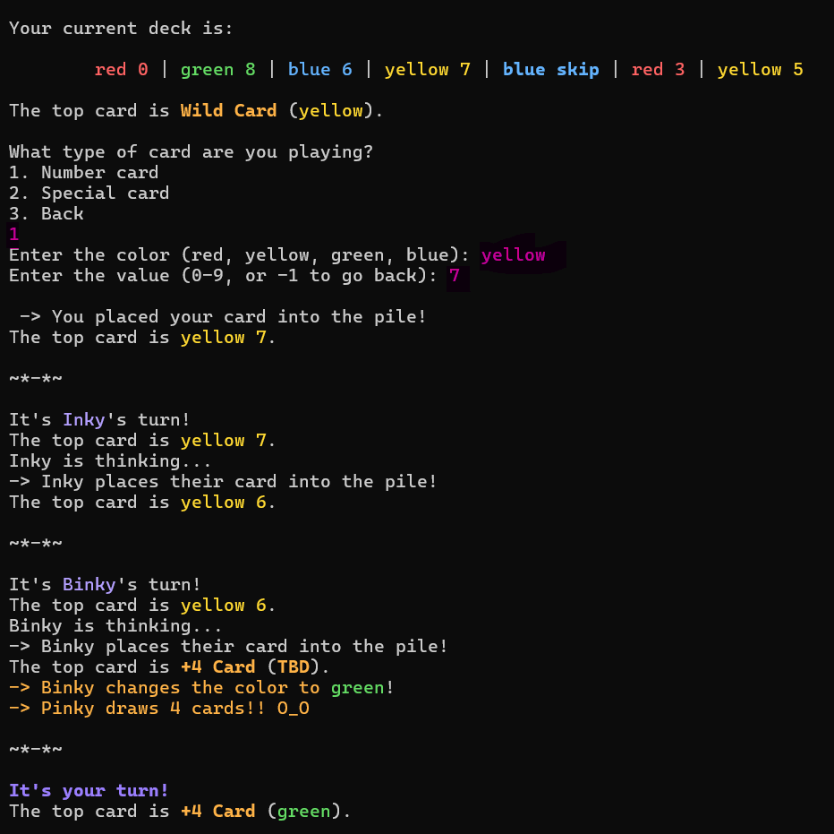
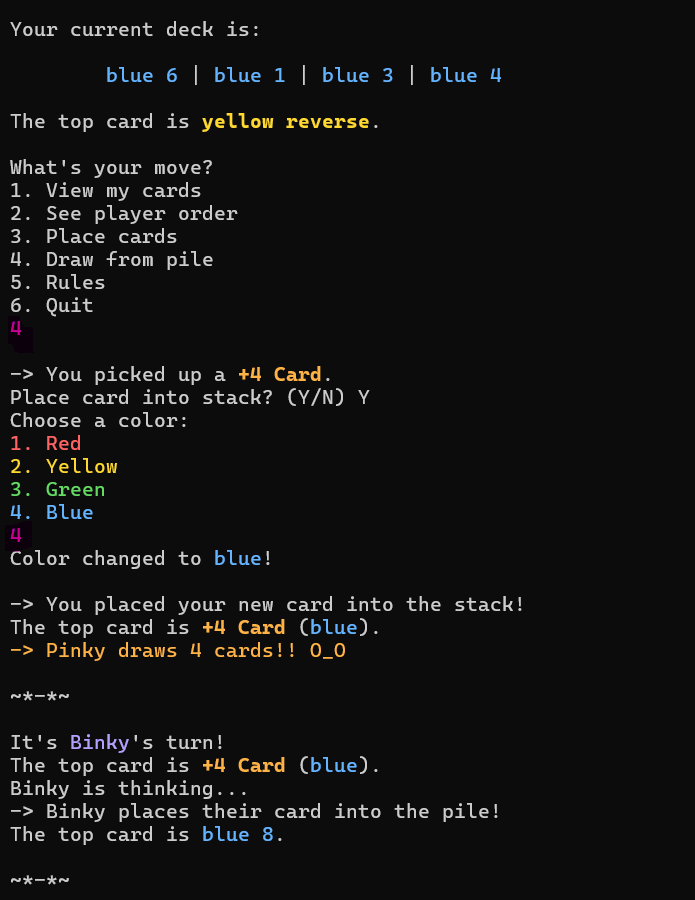
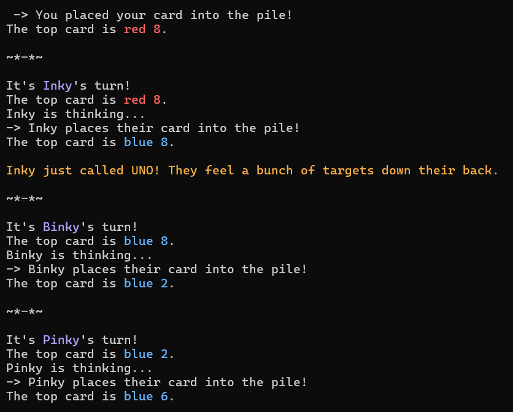
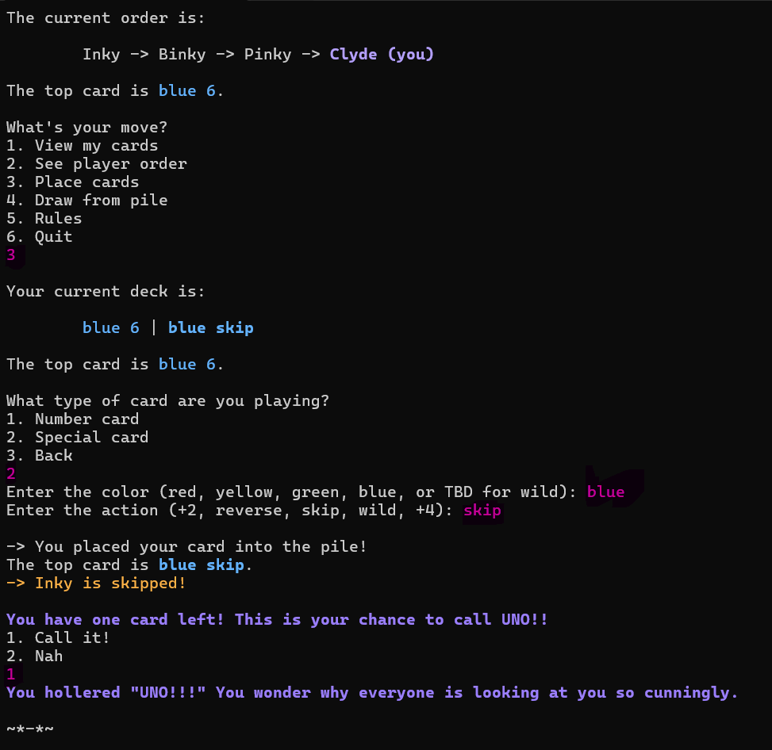
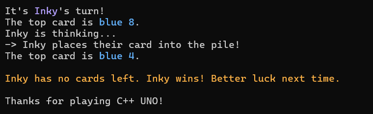
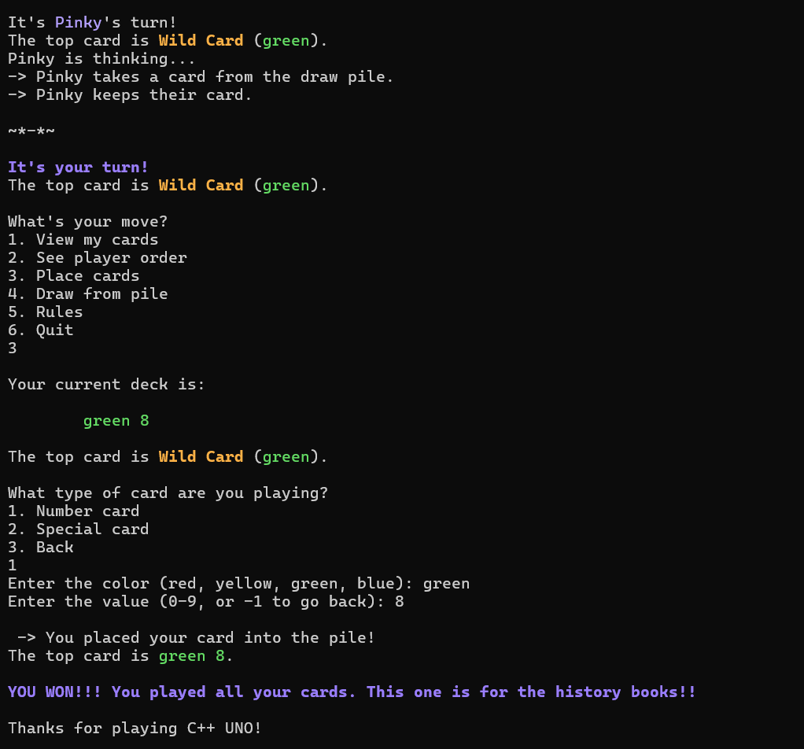
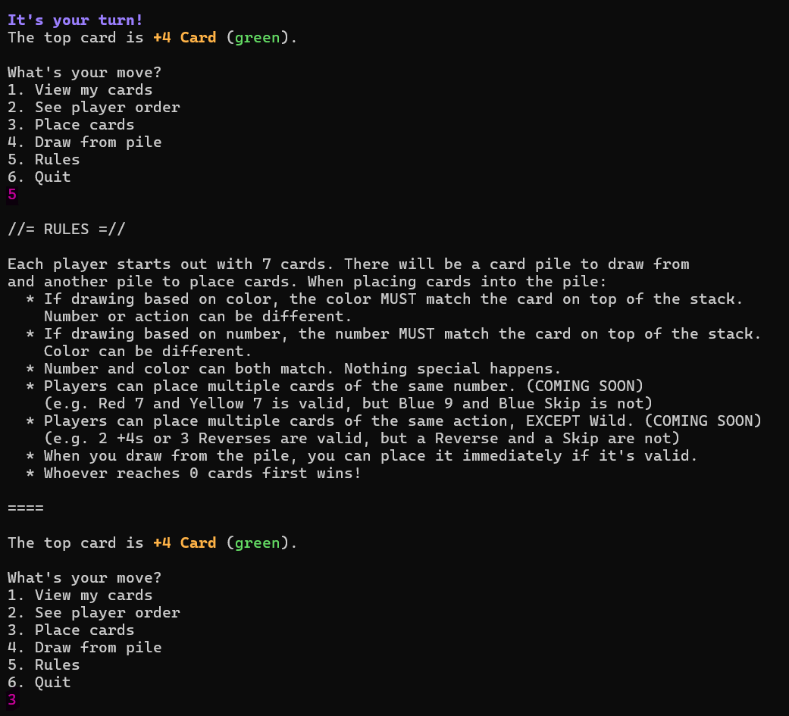

# 🎴 C++ UNO
> A fully playable 2-4 player UNO game in C++ featuring polymorphism, a circular doubly linked list, and a colorful ANSI terminal UI experience!

---

# ⋆｡°✩ ★ FEATURES
- **2-4 player support** - 1 human player vs up to 3 AI opponents
- **Full UNO ruleset** - number cards, action cards (Skip, Reverse, +2), and wild cards (+4, Wild)
- **Rainbow ANSI terminal UI** - every program needs a little color. Every card prints in its own color, special cards in bold, current player highlighted in lavender
- **Circular doubly linked list** for player turn management. Supports Reverse, Skip, and wrap-around naturally
- **AI thinking delay** - 3-7 second randomized pause per AI turn (so the immersion feels real)
- **UNO detection** - calls out players who have 1 card left, and human prompted to either call it or skip it (punished greatly for the latter)
- **Duplicate card grouping** - displays ```Red 8 (x2)``` instead of listing the same card twice
- **Played card stacking** - cards already played appear greyed out in your hand
- **Reshuffle logic** - automatically reshuffles the discard pile into the draw pile if it runs out mid-game

---

# ⋆｡°✩ ★ SCREENSHOTS

<!-- IMAGE 1 -->
<div align="center">
  <p><sub><i>(User input is in pink or yellow!)</i></sub></p>
  
  
  <p><i>Colorful hand display. Special cards are emboldened!</i></p>

</div>

<!-- IMAGE 2 AND 3 -->
<table align="center">
  <tr>
    <!-- image 2 -->
    <td align="center">
      
      <p><i>Welcome + Player Setup</i></p>
    </td>
    <!-- image 3 -->
    <td align="center">
      
      <p><i>Inky shuffles - lavender highlight shows who goes first</i></p>
    </td>
  </tr>
</table>

<!-- IMAGE 4 AND 5 -->
<table align="center">
  <tr>
    <!-- image 4 -->
    <td align="center">
      
      <p><i>Binky hitting Pinky with a +4</i></p>
    </td>
    <!-- image 5 -->
    <td align="center">
      
      <p><i>Drawing a +4 from the pile and unleashing it :3</i></p>
    </td>
  </tr>
</table>

<!-- IMAGE 6 AND 7 -->
<table align="center">
  <tr>
    <!-- image 6 -->
    <td align="center">
      
      <p><i>Time to lock in.</i></p>
    </td>
    <!-- image 7 -->
    <td align="center">
      
      <p><i>UNO FOR CLYDE!</i></p>
    </td>
  </tr>
</table>

<!-- IMAGE 8 AND 9 -->
<table align="center">
  <tr>
    <!-- image 8 -->
    <td align="center">
      
      <p><i>We can't all be winners...</i></p>
    </td>
    <!-- image 9 -->
    <td align="center">
      
      <p><i>NEVERMIND!!</i></p>
    </td>
  </tr>
</table>

<!-- IMAGE 10 -->
<div align="center">
  
  <p><i>Full rules display accessible at any time during the game</i></p>
</div>

<hr>
